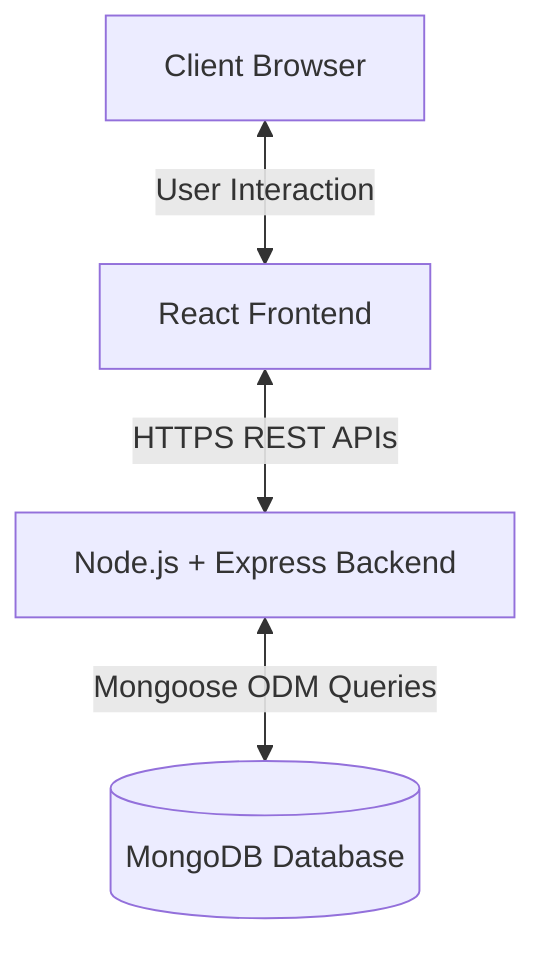

# 04. System Architecture

## 1. Overview
EduSphere follows a client–server three-tier architecture using the MERN stack (MongoDB, Express.js, React.js, Node.js). It is designed to be scalable, secure, and deployment-ready, with a clear separation of concerns between UI, business logic, and persistent storage.

## 2. High-Level Architecture Diagram

## 3. Presentation Layer (Frontend)
- **Technology:** React.js
- **Design Paradigm:** Component-based UI architecture with a Desktop-first responsive design.
- **Routing:** Role-based conditional routing using React Router. Components are structurally grouped by user role (`/student`, `/faculty`, `/admin`).
- **State Management:** Local state using React Hooks. Auth state (JWT token) is stored securely on the client side. API-driven data rendering is handled utilizing Axios.

## 4. Application Layer (Backend)
- **Technology:** Node.js, Express.js
- **Design Paradigm:** RESTful API architecture with a stateless API design.
- **API Structure:** Endpoints are modularly grouped by entity (Auth, Users, Courses, Materials, Quizzes, Assignments, Special Section).
- **Security & Middleware:**
  - JWT-based authentication middleware.
  - Role-based authorization middleware (Student, Faculty, Admin).
  - Secure file upload and validation middleware.
  - Centralized error-handling middleware returning appropriate HTTP status codes.
- **Business Logic Layer:** Handles domain-specific rules (e.g., assignment deadline enforcement, automated MCQ evaluation, course enrollment validation).

## 5. Data Layer (Database)
- **Technology:** MongoDB, Mongoose ODM
- **Design Paradigm:** Document-oriented NoSQL database.
- **Design Principles:**
  - Scalable schema design utilizing normalized references (e.g., embedding ObjectIDs for relationships).
  - Indexed fields to ensure high performance on common queries (e.g., indexing `email` and `courseId`).
  - Role-based attributes stored securely within user documents.

## 6. File Architecture & Storage
- **Supported Upload Types:** Study materials (PDFs, PPTs), Assignments, Special Section resources (ZIPs, Docs), User Profile photos.
- **Handling Strategy:** The backend performs file type and size validation. Files are securely stored, and their respective paths or URLs are persisted as string references in the database.

## 7. Scalability & Extensibility Edge
- Easily scalable horizontally due to stateless Node.js APIs.
- Frontend and Backend can be independently built and deployed (e.g., Frontend on Vercel/Netlify, Backend on AWS/Render/Heroku, Database on MongoDB Atlas).
- Modular controller/service pattern prepares the codebase for future additions (like real-time notifications or a separate grading service).
